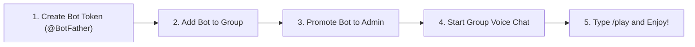

# 🎻 Soul King Brook Music Bot — Ultimate Beginner's Guide

Welcome to the **Soul King Brook Telegram Music Bot**! Whether you are hosting a party in your Telegram group, hanging out with friends in a Voice Chat, or listening to your favorite setlist together, this guide will walk you through everything you need to know in simple, plain English—**no technical or coding background required!**

---

## 📖 Table of Contents

1. [What is Brock Music Bot?](#-1-what-is-brock-music-bot)
2. [How Voice Chat Works in Telegram](#-2-how-voice-chat-works-in-telegram)
3. [Complete Command List (Categorized)](#-3-complete-command-list)
   - [🎵 Music & Search Commands](#-music--search-commands)
   - [🎛️ Playback Control Commands](#️-playback-control-commands)
   - [📋 Queue & Setlist Commands](#-queue--setlist-commands)
   - [🎙️ Voice Chat & Info Commands](#️-voice-chat--info-commands)
4. [Step-by-Step Setup Guide (For Group Owners)](#-4-step-by-step-setup-guide)
5. [Who Can Control the Music? (Permissions System)](#-5-who-can-control-the-music)
6. [Frequently Asked Questions (FAQ) & Troubleshooting](#-6-frequently-asked-questions-faq--troubleshooting)

---

## 🎶 1. What is Brock Music Bot?

**Brock Music Bot** is an automated musical assistant inspired by **Brook (Soul King)** from *One Piece*! 

It joins your Telegram Group Voice Chat as a participant and streams high-quality music directly into the voice call. 

> [!TIP]
> **Key Features Made Simple:**
> - **Instant Streaming**: Music plays instantly without waiting for long file downloads.
> - **Multi-Platform Support**: Works with YouTube links, Spotify tracks, SoundCloud, Apple Music, and direct file URLs.
> - **Smart Intent Recognition**: Type simple human song names like `/play play binks sake from one piece` and the bot understands what you mean!
> - **Fair Queueing**: Multiple people can add songs to the playlist without accidentally stopping the currently playing music!

---

## 🎙️ 2. How Voice Chat Works in Telegram

1. Open your **Telegram Group**.
2. Start a **Voice Chat** or **Video Chat** in the group menu (top right menu).
3. Type `/play [song name or link]` in the group chat box.
4. The bot's assistant account automatically joins your Voice Chat and begins playing your music instantly!

---

## 📜 3. Complete Command List

Here is the complete list of all available commands. You can type any of these directly into your Telegram group chat box.

### 🎵 Music & Search Commands

| Command | What It Does | Example Usage |
| :--- | :--- | :--- |
| `/play [song name or link]` | Searches for a song and plays it in the Voice Chat. If music is already playing, it adds the song to the end of the queue. | `/play Binks Sake` <br> `/play https://youtu.be/dQw4w9WgXcQ` |
| `/vplay [video name or link]` | Streams video/audio source for high quality group video chats. | `/vplay One Piece Opening 1` |

> [!NOTE]
> **Example**:
> Typing `/play Memories One Piece` will search across music sources, pick the highest quality result, and start playing!

---

### 🎛️ Playback Control Commands

| Command | What It Does | Who Can Use It? | Example Usage |
| :--- | :--- | :--- | :--- |
| `/pause` | Pauses the music currently playing. | Session Controller / Group Admin | `/pause` |
| `/resume` | Unpauses and resumes music playback. | Session Controller / Group Admin | `/resume` |
| `/skip` | Skips the current song and immediately starts playing the next song in the queue. | Session Controller / Group Admin | `/skip` |
| `/prev` | Replays the previous track from history. | Session Controller / Group Admin | `/prev` |
| `/stop` | Stops playback, clears the song queue, and resets the bot. | Session Controller / Group Admin | `/stop` |
| `/seek [seconds]` | Jumps forward or backward to a specific timestamp in the current song (in seconds). | Session Controller / Group Admin | `/seek 60` *(jumps to 1 min)* |
| `/volume [0-200]` | Adjusts playback volume (0 = silent, 100 = default, 200 = double volume). | Session Controller / Group Admin | `/volume 120` |

---

### 📋 Queue & Setlist Commands

| Command | What It Does | Who Can Use It? | Example Usage |
| :--- | :--- | :--- | :--- |
| `/queue` | Displays the current playlist (setlist) of upcoming songs waiting to play. | **Everyone (Public)** | `/queue` |
| `/now` | Shows the song currently playing, artist details, and a live progress bar. | **Everyone (Public)** | `/now` |
| `/shuffle` | Randomly shuffles the order of upcoming songs in the queue. | Session Controller / Group Admin | `/shuffle` |
| `/loop [off \| track \| queue]` | Sets loop mode: <br> • `off`: Plays straight through <br> • `track`: Repeats the active song <br> • `queue`: Loops the whole playlist | Session Controller / Group Admin | `/loop track` <br> `/loop queue` <br> `/loop off` |

---

### 🎙️ Voice Chat & Info Commands

| Command | What It Does | Who Can Use It? | Example Usage |
| :--- | :--- | :--- | :--- |
| `/start` | Displays the bot's Soul King greeting card and quick start tips. | **Everyone (Public)** | `/start` |
| `/help` | Opens the interactive command guide with clickable category buttons. | **Everyone (Public)** | `/help` |
| `/stats` | Displays bot performance, active voice chats, and engine status. | **Everyone (Public)** | `/stats` |
| `/playerdebug` | Shows live diagnostic info (Voice status, session owner, error logs). | Group Admin / Bot Owner | `/playerdebug` |

---

## 🛠️ 4. Step-by-Step Setup Guide

Follow these simple steps if you are adding Brook Music Bot to a brand new Telegram Group:



### Step 1: Add the Bot to Your Group
1. Open your Telegram Group.
2. Click on Group Info ➡️ **Add Member**.
3. Search for your bot username (e.g., `@YourBrookBot`) and tap **Add**.

### Step 2: Promote the Bot to Admin
1. Open Group Info ➡️ Edit ➡️ **Administrators**.
2. Tap **Add Admin**, select the bot.
3. Enable standard permissions: **Delete Messages**, **Invite Users via Link**, and **Manage Voice Chats**.
4. Tap **Done** to save.

### Step 3: Start Voice Chat & Play
1. Start a Voice Chat in your Telegram group.
2. Send `/play Binks Sake` in the group chat.
3. Yohohoho! The bot will join and start playing music!

---

## 🛡️ 5. Who Can Control the Music?

To stop random group members from trolling or cutting off music while someone is listening, Brook Music Bot uses a simple **Role Hierarchy**:

```
👑 Bot Owner (Global Administrative Override)
  └── 🛡️ Group Admins (Group Administrator Controls)
        └── 🔒 Session Controller (User who started active playback)
              └── 🌐 Public Users (Can add songs to queue, view /now & /queue)
```

> [!IMPORTANT]
> **Interruption Protection**:
> If a friend started music with `/play`, they become the **Session Controller**.
> Other group members can still send `/play song_name` to add songs to the queue safely. However, non-controllers cannot accidentally `/pause`, `/skip`, or `/stop` the host's active music!

---

## ❓ 6. Frequently Asked Questions (FAQ) & Troubleshooting

### Q1: Why is the bot not playing sound when I use `/play`?
- **Answer**: Make sure you have **started a Voice Chat** in your Telegram group first! The bot cannot play audio unless an active Voice Chat room exists.

### Q2: Can I send Spotify or YouTube links?
- **Answer**: Yes! You can paste direct links from **YouTube** (`https://youtu.be/...`), **Spotify** (`https://open.spotify.com/track/...`), **SoundCloud**, **Apple Music**, or direct audio URLs (`.mp3`/`.opus`).

### Q3: How do I remove or skip a song?
- **Answer**: If you started the music (or are a Group Admin), simply type `/skip` to jump to the next song!

### Q4: How do I change the volume?
- **Answer**: Type `/volume 150` to increase volume, or `/volume 80` to lower it. (Volume range is `0` to `200`).

---

*Yohohoho! Feel the music in your bones with Soul King Brook!* 🎻
